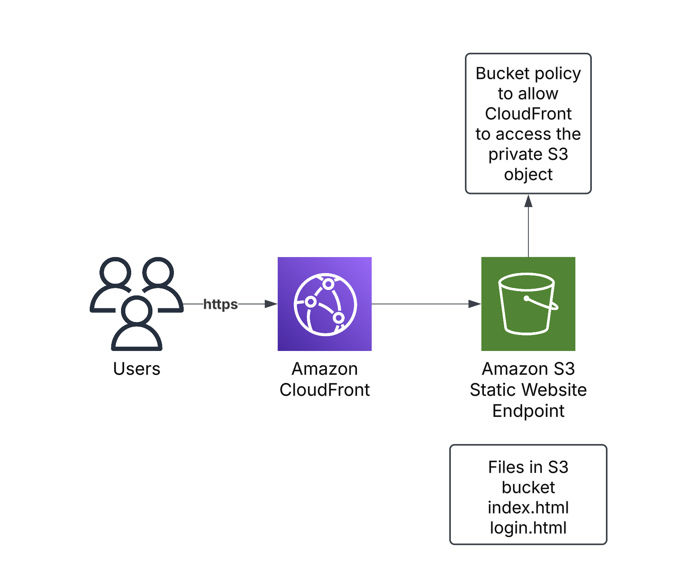

# 🚀 Hosting a Secure & Global Static Website on AWS  
### Using Amazon S3 + Amazon CloudFront  
---

## 📌 Problem Statement

You want to host a static website (HTML, CSS, JS) on AWS in a **cheap, serverless, scalable** manner.  
Amazon S3 looks like the perfect choice — but it has critical limitations:

### ❌ Static Website on S3 (Alone)
- S3 website endpoints allow **HTTP only**  
- Requires a **public bucket**  
- Not secure → traffic can be intercepted  
- Website is **fast only regionally**, slow for global users  
- No global caching  
- No built-in content filtering, access control, or latency optimization

**Conclusion:**  
S3 alone is NOT secure or globally optimal for hosting a public website.

---

## ✅ Solution: Use Amazon CloudFront (CDN) in Front of S3



CloudFront solves S3’s issues and provides:

- ✔ **Full HTTPS** (secure website)
- ✔ **Private S3 bucket** using Origin Access Control (OAC)
- ✔ **Edge caching → ultra-fast worldwide**
- ✔ **Access control at the edge**
- ✔ **Failover / high availability**
- ✔ **Geo-based restrictions**
- ✔ **Cache behavior controls**
- ✔ **Custom logic with CloudFront Functions / Lambda@Edge**

**CloudFront is the recommended, production-grade solution.**

---

# 🎥 Demo Flow (Step-by-Step)

## 🟣 **DEMO 1 — Create CloudFront Distribution for the S3 Bucket**
1. Select S3 bucket as Origin  
2. Enable **Viewer Protocol → Redirect HTTP to HTTPS**  
3. Leave S3 bucket public initially (for testing)

---

## 🟣 **DEMO 2 — Secure the S3 Bucket Using Origin Access Control (OAC)**

### Why OAC?
- We want **S3 to be private**, and only CloudFront can access it.

### Steps:
1. Create **Origin Access Control (OAC)**  
2. Attach it to the CloudFront distribution  
3. Update the **bucket policy** generated by AWS  
4. Make sure the bucket is **NOT public**

### Test:
- Try hitting the S3 static website URL →  
  **Expected:** `403 Forbidden`  
  Because only CloudFront should access S3 now.

---

## 🟣 **DEMO 3 — Default Root Object & Cache Behavior**

### Default Root Object
Set: index.html

If you skip this:  
CloudFront → **AccessDenied** error  
because it doesn’t know what to serve at `/`.

### Demonstrate Cache Behavior:
1. Modify a file (e.g., update HTML banner)  
2. Refresh CloudFront URL → change does **NOT** appear  
3. Create **Invalidation**  
4. Refresh again → new content shows  
5. Explain TTL briefly  

---

## 🟣 **DEMO 4 — Restrict Access to Certain Files**

By default: All the files present in S3 bucket can be accessed directly using Cloudfront Distribution URL directly
```
    https://your-distribution.cloudfront.net/about.html

    https://your-distribution.cloudfront.net/secret.html
```

### Solution Options:
#### ✔ CloudFront Functions  
- Good for blocking paths  
- Super fast, cheap  
- Runs at Viewer Request  
- **Cannot do heavy logic**  
- Perfect for:  
  - Block `/admin/*`  
  - Allow `/public/*`  
  - Country-based path blocking  

#### ✔ Lambda@Edge  
Use when you need more power:
- Fetch external APIs  
- Validate JWTs  
- Decrypt tokens  
- Modify headers deeply  
- Add dynamic logic  
- Advanced conditional access


---

# 🌍 CloudFront Advanced Features to Demonstrate

### 🔵 **1. Regional / Origin Failover**
- Configure **Primary Origin → S3 (Main bucket)**  
- Configure **Secondary Origin → S3 (Backup bucket)**  
- If primary fails, CloudFront automatically switches  
- Zero downtime → high availability

---

### 🟡 **2. Geo-Based Access Control**

#### **Basic (Entire Country Block)** → *Use Geo Restriction Setting*
Example:
- Block traffic from China, Russia, North Korea  
- No coding needed  
- Works globally across all paths

#### **Advanced (Path-based Country Control)** → *Use CloudFront Functions*
Example:
- Block `/premium/*` for India  
- Allow `/free/*`


### 🟠 **3. Difference: CloudFront Functions vs Lambda@Edge**

| Feature | CloudFront Functions | Lambda@Edge |
|--------|----------------------|-------------|
| Execution Stage | Viewer Request & Response | Viewer + Origin Request/Response |
| Performance | Very fast (microsecond) | Slower (millisecond) |
| Cost | Very cheap | Higher |
| Can Call APIs | ❌ No | ✔ Yes |
| Can Decode JWT | ❌ No | ✔ Yes |
| Can Modify Body | ❌ No | ✔ Yes |
| Use Case | Simple auth, redirects, blocking | Complex auth, personalization, API calls |

---

# 🔴 Current Limitation

Even though CloudFront provides:

- HTTPS  
- Global CDN  
- Security  
- Caching  
- Failover  
- Path control  
- Geo restrictions  
- Edge logic  

👉 **We STILL do not have any backend processing.**

Your website is:

- STATIC  
- No server-side logic  
- No authentication  
- No API  
- No database  
- No dynamic pages  

### ❗ To add backend processing, you will need:
- AWS Lambda  
- API Gateway  
- DynamoDB  
- Cognito (Auth)  
- Lambda@Edge (advanced auth)  

---

